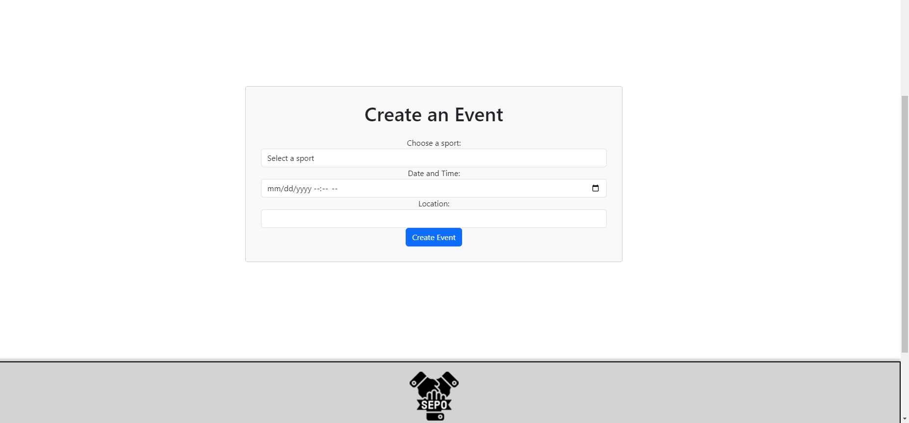

# SEPO-project3

[Link To live Deploy](placeholder)

## Sporting event scheduler

Introducing S.E.P.O (Sporting Event Promoters Online), the ultimate solution for seamlessly scheduling and managing sports events. Our app simplifies the process by allowing users to effortlessly create and organize events within the platform. From there, participants can easily sign up, with event details such as location, event type, and name readily available, along with an interactive map feature for precise navigation. With S.E.P.O, coordinating sports activities has never been easier, ensuring that every game, practice session, or tournament runs smoothly and efficiently.

## Table of Contents

- [Introduction](#sporting-event-scheduler)
- [Images](#images)
- [How to Install and Run the Project](#how-to-install-and-run-the-project)
- [How to Use SEPO](#how-to-use-the-app)
- [Badges](#badges)
- [Contributors](#contributors)
- [Licsense](#licsence)

## Images

## How to install and run the project

In Order to run and edit this project locally you can:

#### 1. Clone the repository from GitHub

#### 2. Open the root terminal

#### 3. Run "Npm i"

#### 4. Run "Npm run develop" 

#### 5. Open it at: http://localhost:3000/

## How to use the app
To use SEPO, you can first siggn up, by going to the "Sign Up" tab in the header, after you have done that, you can join events from the "Join Events" tab, or create events from the "Create Event" tab. Optionally you can also view your joined events. 

## Badges 

## Contributors
[Aubrey Johnson](https://github.com/aubreymlj96)

[Garrett Sheppard](https://github.com/gmoney3303)

[Evan Fodemski](https://github.com/EvanFodemski)

## Licsence

All assets and code are under the MIT licsence

